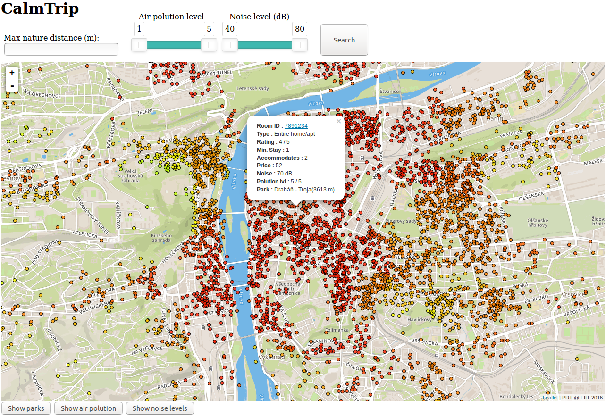

# General course assignment

Build a map-based application, which lets the user see geo-based data on a map and filter/search through it in a meaningfull way. Specify the details and build it in your language of choice. The application should have 3 components:

1. Custom-styled background map, ideally built with [mapbox](http://mapbox.com). Hard-core mode: you can also serve the map tiles yourself using [mapnik](http://mapnik.org/) or similar tool.
2. Local server with [PostGIS](http://postgis.net/) and an API layer that exposes data in a [geojson format](http://geojson.org/).
3. The user-facing application (web, android, ios, your choice..) which calls the API and lets the user see and navigate in the map and shows the geodata. You can (and should) use existing components, such as the Mapbox SDK, or [Leaflet](http://leafletjs.com/).

## Example projects

- Showing nearby landmarks as colored circles, each type of landmark has different circle color and the more interesting the landmark is, the bigger the circle. Landmarks are sorted in a sidebar by distance to the user. It is possible to filter only certain landmark types (e.g., castles).

- Showing bicykle roads on a map. The roads are color-coded based on the road difficulty. The user can see various lists which help her choose an appropriate road, e.g. roads that cross a river, roads that are nearby lakes, roads that pass through multiple countries, etc.

## Data sources

- [Open Street Maps](https://www.openstreetmap.org/)

## My project
**Application description**:

**CalmTrip** allows you to find the right accommodation for your trip to Prague.
It can display air polution levels, noise levels and nature parks and allows to search accommodation by environment parameters. 
The results are displayed on map as points.
Quality of accommodation is visualized by color (interpolation between Green - best and Red - worst).
The points displayed on the map can be clicked to display tooltip with detailed information (Airbnb and environment information). 


**Data source**: 
- [Airbnb Data Collection: Downloadable Data and City Maps](http://tomslee.net/airbnb-data/)
- [Geoportal Praha OpenData](http://www.geoportalpraha.cz/cs/opendata)

**Technologies used**:
- Client : HTML, Javascript, Leaflet (+ Mapbox)
- Server : Python, Bottle
- Database : PostgreSQL with PostGIS extension

The application is usable as docker container.
To run, execute following commands:

```bash
docker build . -t calmtrip
docker run -p 8080:8080 calmtrip
```

The application is then accessible via web browser on `localhost:8080`


