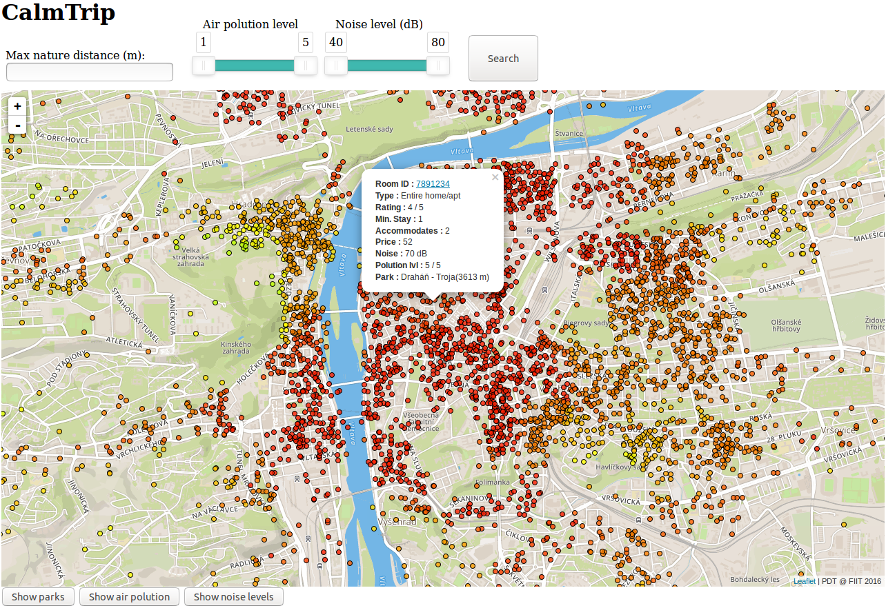

# Overview

**CalmTrip** shows accommodation in Prague (from Airbnb) on a map. Most important features are:
- Search by air polution, noise level and distance to nature park
- Quality of accommodation is visualized by color on the map
- Display parks, air polution and noise zones.
- Tooltip with detailed information of the accommodation and its environment.

This is it in action:



The application consists of a **client** which is a [frontend web application](#frontend) created with HTML, Javascript, [Leaflet](http://leafletjs.com/) and [Mapbox](https://www.mapbox.com/) maps and a **server**, which is a [backend application](#backend) created with [Python](https://www.python.org/) and [Bottle web framework](https://bottlepy.org/), with data stored in a PostgreSQL database with [PostGIS extension](http://www.postgis.net/). The frontend application communicates with the backend using a simple [REST API](#api).
It is prepared as a **Docker container** for simple deployment. When started, the application is accessible via browser at **localhost:8080**

# Frontend
The frontend application is a simple static HTML page (`app/index.html`), which shows a Leaflet map and elements for interaction with the map.
It is displaying accommodations from Airbnb in Prague, where the Streets map style fits nicely.

All relevant frontend code is in `app/index.html`. The frontend code is very simple, its responsibilities are:
- Displaying the Leaflet map
- Displaying interaction elements which are used for searching and toggling nature park, air polution and noise layers
- Displaying geo features by overlaying the map with a geojson layer provided provided by the backend APIs
- Creating dynamic style of geo features according to their properties (various)

Air polution polygons style has variable color (greyscale) and opacity according to level value (1-5).

Noise polygons style has variable color according to level value (40-80).

Nature parks polygons have constant green color

Accommodation points style has variable color (from green ... yellow ... to red) according to air polution and noise, which is interpreted as quality of the accomodation.

# Backend

The backend application is written in **Python** using **Bottle** web framework (`app/server.py`), it serves the frontend `index.html` file and exposes a simple REST API.
It is responsible for querying the database for geo data and returning it to the frontend in GeoJSON format.
Python module Psycopg2 is used for connection and querying the PostgreSQL database. 
The SQL queries are constructed in such a way that they directly return Feature Collection GeoJSON, which is returned to the frontend, so no further formatting or conversion on the backend is needed.
Query with parameters from user input uses prepared statements to avoid SQL injection.

## Data

The accommodation data comes from [Airbnb Data Collection: Downloadable Data and City Maps](http://tomslee.net/airbnb-data/) in convenient CSV format, which can be directly imported using Postgres **COPY** command.
It has coordinates in latitude and longitude format, which are converted with standard `ST_MakePoint` function to WGS84 geometry (4326).
The environment data comes from [Geoportal Praha OpenData](http://www.geoportalpraha.cz/cs/opendata).
- Air polution - available in Feature Collection GeoJSON format, no preprocessing needed.
- Nature parks - available in Feature Collection GeoJSON format, no preprocessing needed.
- Noise - available in **GML** format, used [ogr2ogr](http://www.gdal.org/ogr2ogr.html) to convert it to Feature Collection GeoJSON. The original noise data was big and too detailed, the polygons were simplified by using [mapshaper](http://mapshaper.org/) (~120MB -> ~1MB)

The data was then converted to CSV format (with custom script), separating its properties and polygon data(GeoJSON) to columns so it could be imported with **COPY** command, following use of `ST_GeomFromGeoJSON` to get geometry.

Spatial indexes were created on geometry column of all tables to speed up queries which find intersections of accomodation points with air polution and noise polygons.
Indexes were also created on other columns used in search queries - air polution level, noise level and nature park distance.

The queries used to create the database tables and import the data can be found in `init.sql` file.
The queries used by backend can be found in `app/server.py` file.

Feature Collection GeoJSON is generated by using a combination of standard functions `row_to_json, array_to_json, array_agg, st_asgeojson` in query and no post processing on backend is needed ([query source](http://www.postgresonline.com/journal/archives/267-Creating-GeoJSON-Feature-Collections-with-JSON-and-PostGIS-functions.html)).

## Api
**Find all accommodation**

`GET /default`

**Find all nature parks**

`GET /parks`

**Find all noise level zones**

`GET /noise`

**Find all air polution zones**

`GET /polution`

**Find accomodation by specifying minimum and maximum air polution and noise**

`GET /search?noise_min=40&noise_max=60&polution_min=1&polution_max=4`

**Find accomodation by maximum distance to nature park with minimum and maximum air polution and noise**

`GET /search?noise_min=40&noise_max=60&polution_min=1&polution_max=4&max_park_distance=500`

### Response
API calls return Feature Collection GeoJSON, which for each matched entry contains `geometry` and `properties` with additional information. The attributes are self explaining.
Accommodation properties example:
```
{
	"room_id": 7936175,
	"minstay": 1,
	"accommodates": 2,
	"price": 22,
	"room_type": "Private room",
	"polution_level": 4,
	"noise_level": 65,
	"overall_satisfaction": 5,
	"park_name": "Smetanka",
	"park_distance": 42
}
```
Nature parks properties example:
```
{
	"name": "Draháň - Troja"
}

```
Air polution properties example:
```
{
	"level": 3
}
```
Noise level zones properties example:
```
{
	"level": 40
}
```
# More screenshots:


The screenshot shows a search for accommodation in close distance to nature park with low air polution and noise level (no red points). 


The screenshot shows air polution zones


The screenshot shows noise level zones
